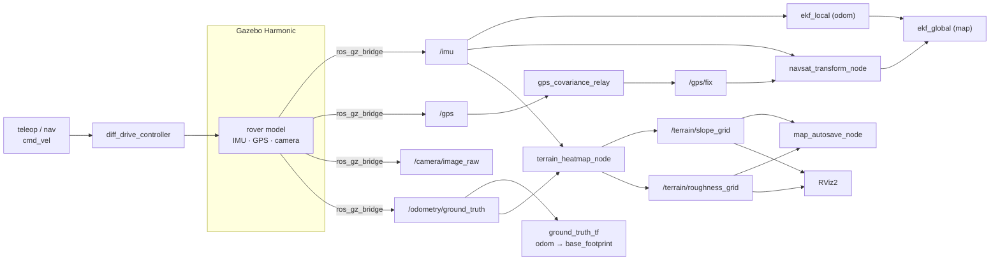

# 🛰️ rover_ws — Proprioceptive Terrain-Mapping Rover (ROS 2 + Gazebo)


A ROS 2 simulation workspace for a four-wheeled, skid-steer **inspection rover** that drives over uneven terrain and builds a **proprioceptive terrain quality map** — a georeferenced heatmap of ground **slope** and **roughness** computed purely from the onboard IMU and odometry. It is the simulation twin of a physical ESP32 / micro-ROS rover built for the same project.

The system runs a full robotics stack in **Gazebo (Harmonic)**: a URDF-described rover with IMU, GPS and RGB camera, `ros2_control` differential drive, sensor fusion via `robot_localization` (local + global EKF and GPS integration), and a custom mapping pipeline that turns ride dynamics into an `OccupancyGrid` heatmap visualised in RViz.

> **Course context.** Developed for **INF 208 – Eingebettete Systeme** at the Türkisch-Deutsche Universität (TAU). The mapping idea (detecting potholes / bumps and producing a ground-quality map) targets Smart-City infrastructure inspection. A physical twin of this rover runs the same sensor suite on an ESP32 as a micro-ROS client.

---

## ✨ Features

- **Full Gazebo Harmonic simulation** of a 4-wheel skid-steer rover (URDF/Xacro), dimensioned after the real hardware kit (25.5 × 15 cm chassis, 65 mm wheels).
- **`ros2_control` differential drive** (`diff_drive_controller`) with skid-steer slip compensation.
- **Simulated sensors** bridged from Gazebo: 6-axis **IMU**, **NavSat GPS**, and an **RGB camera**.
- **Sensor fusion** with `robot_localization`: a local EKF (`odom` frame), a global EKF (`map` frame) and `navsat_transform_node` for GPS integration, plus a GPS-covariance relay.
- **Proprioceptive terrain heatmap**: live `slope` and `roughness` `OccupancyGrid`s built from IMU + odometry, with per-cell peak tracking, IIR filtering and outlier rejection.
- **Map persistence**: autosave on shutdown and an on-demand `/save_map` service that writes `.npy` + `.yaml` map files.
- **One-command demo launch** that brings up simulation, control, localization, mapping and a pre-configured RViz.

---

## 🗂️ Repository structure

```
rover_ws/
└── src/
    ├── rover_bringup/        # Top-level launch files + Gazebo worlds
    │   ├── launch/
    │   │   ├── bringup_demo.launch.py   # ⭐ full demo: sim + control + EKF + heatmap + RViz
    │   │   ├── rover_gazebo.launch.py   # sim + robot + controllers + localization
    │   │   └── empty_world.launch.py    # bare Gazebo empty world
    │   └── worlds/                      # sensor_world.sdf, terrain_world.sdf, terrain generator
    ├── rover_description/    # URDF/Xacro robot model + sensor plugins
    │   ├── urdf/rover.urdf.xacro
    │   └── launch/display.launch.py     # view the model in RViz (joint sliders)
    ├── rover_control/        # ros2_control configuration
    │   └── config/controllers.yaml      # diff_drive_controller + joint_state_broadcaster
    ├── rover_localization/   # robot_localization EKF + GPS fusion
    │   ├── config/           # ekf_local.yaml, ekf_global.yaml, navsat_transform.yaml
    │   └── scripts/          # gps_covariance_relay.py, ground_truth_tf.py
    └── rover_mapping/        # Proprioceptive terrain heatmap
        ├── rover_mapping/terrain_heatmap_node.py   # slope + roughness OccupancyGrids
        ├── rover_mapping/map_autosave_node.py      # autosave + /save_map service
        └── config/rover_heatmap.rviz               # RViz layout for the heatmap
```

---

## 🧩 System overview



### Key topics

| Topic | Type | Produced by | Notes |
|---|---|---|---|
| `/imu` | `sensor_msgs/Imu` | Gazebo bridge | 6-axis IMU |
| `/gps` | `sensor_msgs/NavSatFix` | Gazebo bridge | raw, **no** covariance |
| `/gps/fix` | `sensor_msgs/NavSatFix` | `gps_covariance_relay` | covariance filled for EKF |
| `/camera/image_raw`, `/camera/camera_info` | `sensor_msgs/Image`, `CameraInfo` | Gazebo bridge | RGB camera |
| `/odometry/ground_truth` | `nav_msgs/Odometry` | Gazebo bridge | sim ground truth |
| `/odometry/filtered` | `nav_msgs/Odometry` | local EKF | `odom` frame |
| `/odometry/filtered_map` | `nav_msgs/Odometry` | global EKF | `map` frame |
| `/odometry/gps` | `nav_msgs/Odometry` | `navsat_transform_node` | GPS as odometry |
| `/terrain/slope_grid` | `nav_msgs/OccupancyGrid` | `terrain_heatmap_node` | slope heatmap @ 5 Hz |
| `/terrain/roughness_grid` | `nav_msgs/OccupancyGrid` | `terrain_heatmap_node` | roughness heatmap @ 5 Hz |
| `/save_map` | `std_srvs/srv/Trigger` (service) | `map_autosave_node` | write maps to disk |

---

## 📦 Requirements

- **Ubuntu 24.04** with **ROS 2 Jazzy**
- **Gazebo Harmonic** (`gz-sim`) with the ROS↔Gazebo bridge

Install the ROS dependencies (most are resolvable via `rosdep`):

```bash
sudo apt update
sudo apt install \
  ros-jazzy-ros-gz \
  ros-jazzy-ros2-control ros-jazzy-ros2-controllers \
  ros-jazzy-robot-localization \
  ros-jazzy-robot-state-publisher ros-jazzy-xacro \
  ros-jazzy-teleop-twist-keyboard ros-jazzy-rviz2
```

Python: `numpy` (used by the mapping nodes).

---

## 🔧 Build

```bash
# clone into a workspace
git clone https://github.com/cankecilioglu/rover_ws.git
cd rover_ws

# resolve dependencies
rosdep install --from-paths src --ignore-src -r -y

# build
colcon build --symlink-install
source install/setup.bash
```

> Re-`source install/setup.bash` in every new terminal (or add it to your `~/.bashrc`).

---

## 🚀 Quick start

Launch the full demo — simulation, controllers, localization, heatmap and RViz:

```bash
ros2 launch rover_bringup bringup_demo.launch.py
```

Launch arguments:

| Argument | Default | Description |
|---|---|---|
| `world` | `sensor_world.sdf` | World file in `rover_bringup/worlds` (e.g. `terrain_world.sdf`) |
| `rviz` | `true` | Open RViz with the heatmap layout |
| `map_dir` | `~/rover_maps` | Directory where saved maps are written |

Example with the terrain world and a custom map directory:

```bash
ros2 launch rover_bringup bringup_demo.launch.py \
  world:=terrain_world.sdf map_dir:=~/rover_maps
```

### Drive the rover

In a second terminal, publish velocity commands to the differential-drive controller. Check the exact command topic first:

```bash
ros2 topic list | grep cmd_vel
```

then drive with the keyboard (remap to the controller’s topic if needed):

```bash
ros2 run teleop_twist_keyboard teleop_twist_keyboard \
  --ros-args -r /cmd_vel:=/diff_drive_controller/cmd_vel
```

As the rover moves over the terrain, the slope and roughness heatmaps fill in live in RViz.

### Save the map

The maps autosave on `Ctrl-C`. To save on demand:

```bash
ros2 service call /save_map std_srvs/srv/Trigger "{}"
```

Each save writes, per grid, a raw `.npy` array and a `.yaml` metadata file (resolution, size, origin, frame) into `map_dir`.

### Other launch files

```bash
# Just the simulation + robot + controllers + localization (no mapping/RViz)
ros2 launch rover_bringup rover_gazebo.launch.py world:=terrain_world.sdf

# Inspect the URDF in RViz with joint sliders
ros2 launch rover_description display.launch.py

# Bare empty Gazebo world
ros2 launch rover_bringup empty_world.launch.py
```

---

## 🗺️ How the terrain heatmap works

`terrain_heatmap_node` subscribes to `/imu` (100 Hz) and `/odometry/ground_truth` (50 Hz) and maintains two grids over a **40 × 40 m** area (200 × 200 cells, 20 cm resolution):

- **Slope grid** — terrain inclination estimated from the projection of gravity in the IMU frame, smoothed with an IIR low-pass (`α = 0.95`, ≈ 0.8 Hz cutoff). Normalised so that **25°** maps to full scale.
- **Roughness grid** — vertical-acceleration energy from an IIR **high-pass** (`α = 0.95`) that removes static tilt, capturing bumps and impacts. Normalised so that **5.0 m/s²** maps to full scale.

Design choices that make the map readable:

- **Per-cell peak (max), not average** — short spikes (a single pothole edge) are not diluted away.
- **Outlier rejection** — slopes above 40° and roughness above 10 m/s² are treated as noise and ignored.
- Output as standard `nav_msgs/OccupancyGrid` (`0–100`, `-1` = unvisited), so it renders directly in RViz and is easy to post-process.

`map_autosave_node` mirrors the same normalisation constants and exports the grids as NumPy arrays plus YAML metadata for offline analysis.

---

## 🧭 Localization & sensor fusion

The `rover_localization` package wires up a standard `robot_localization` dual-EKF setup:

- **`ekf_local`** — continuous `odom`-frame estimate (wheel odometry + IMU).
- **`ekf_global`** — `map`-frame estimate, additionally fused with GPS via **`navsat_transform_node`** (output remapped to `/odometry/filtered_map`).
- **`gps_covariance_relay.py`** — fills the `position_covariance` that the Gazebo NavSat plugin leaves empty (default ≈ 1 m horizontal, 1.5 m vertical), republishing `/gps` as `/gps/fix`.
- **`ground_truth_tf.py`** — broadcasts the `odom → base_footprint` transform from the simulator ground-truth odometry.

---

## 🤖 Robot model & control

- **Chassis:** 25.5 × 15 × 6 cm, ~0.8 kg. **Wheels:** 65 mm diameter, 4-wheel skid steer.
- **Sensors (Gazebo plugins):** IMU (`imu_link`), RGB camera (`camera_link`), NavSat GPS (`gps_link`).
- **Controller:** `diff_drive_controller` at 100 Hz, `wheel_separation = 0.19 m`, `wheel_radius = 0.0325 m`, with a `1.5×` wheel-separation multiplier to compensate for skid-steer slip. Limits: 1.0 m/s linear, 2.0 rad/s angular, 0.5 s `cmd_vel` timeout. Odometry published at 50 Hz.

Key parameters live in `rover_control/config/controllers.yaml`, `rover_localization/config/*.yaml`, and as constants at the top of `terrain_heatmap_node.py`.

---

## 🌍 Worlds

| World | Description |
|---|---|
| `sensor_world.sdf` | Default world for sensor / mapping tests |
| `terrain_world.sdf` | Uneven heightmap terrain for slope & roughness mapping |

`worlds/generate_terrain.py` (with `heightmap.png`) generates the terrain mesh assets.

---

## 🛣️ Roadmap

- Drive the heatmap from the **fused EKF pose** instead of ground-truth odometry (real-world readiness).
- Camera-based defect detection (OpenCV) layered onto the terrain map.
- Autonomous coverage / patrol using Nav2.
- Export to a web dashboard / cloud (MQTT) for fleet-scale mapping.
- Bring the same pipeline online on the physical ESP32 / micro-ROS rover.

---

## 🤝 Contributing

Contributions are welcome!

1. Fork the repository and create a feature branch (`git checkout -b feature/my-change`).
2. Follow the existing code style; Python nodes target ROS 2 Jazzy and pass `ament_flake8` / `ament_pep257`.
3. Keep launch arguments and topic names backwards-compatible where possible.
4. Open a pull request describing the change and how you tested it (which world / launch file).

Please open an issue first for larger features so we can discuss the design.

---

## 📄 License

Released under the **MIT License**. The `rover_mapping` package already ships an MIT `LICENSE`; a top-level `LICENSE` file applies the same terms to the whole workspace. See [`LICENSE`](LICENSE).

---

## 👥 Authors & acknowledgements

Developed by the INF 208 project team at the Türkisch-Deutsche Universität.

- Maintainer: **c4nth** ([@cankecilioglu](https://github.com/cankecilioglu)) — `cankecilioglu@gmail.com`

Built with [ROS 2](https://docs.ros.org), [Gazebo](https://gazebosim.org), [`ros2_control`](https://control.ros.org) and [`robot_localization`](https://github.com/cra-ros-pkg/robot_localization).
